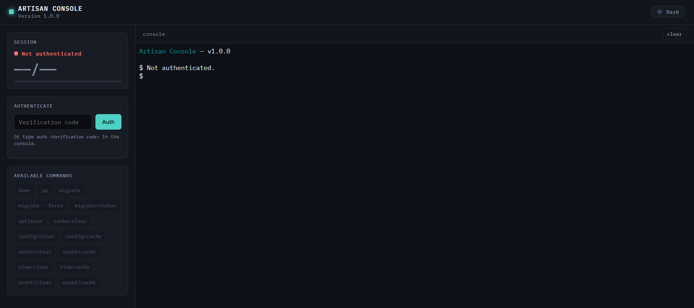
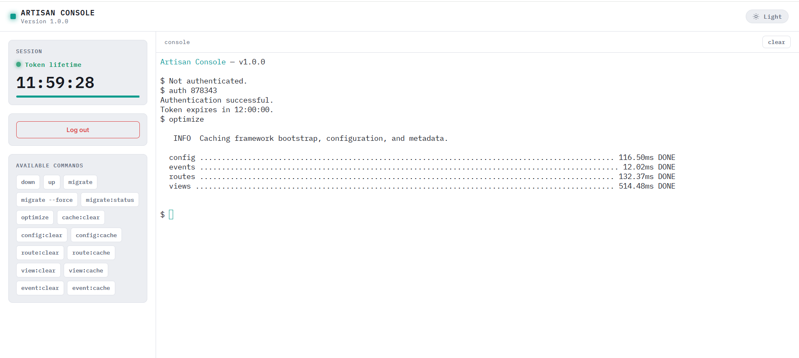

# Artisan Console

A lightweight, single-file PHP web console for running Laravel Artisan commands when SSH or shell access is unavailable.

Artisan Console is designed primarily for shared hosting and restricted hosting environments where you can deploy a Laravel application but cannot access the server terminal.

Instead of requiring SSH access, you can place `artisan_console.php` inside your Laravel application's public directory and execute selected Artisan commands directly from a browser.

Authentication is protected with TOTP (Time-based One-Time Password), and command execution can be restricted to an explicit whitelist.

## Features

* Single PHP file
* Runs Laravel Artisan commands from a web browser
* Designed for shared hosting environments without SSH/Shell access
* TOTP authentication using `pragmarx/google2fa`
* Temporary authenticated session using a signed HTTP-only cookie
* Sandbox mode with an explicit Artisan command whitelist
* No separate backend service required
* Simple terminal-style web interface
* Light and dark theme support

## Screenshots

### Initial Screen



### Light Theme



## Requirements

Artisan Console is intended to run inside an existing Laravel project.

You need:

* A working Laravel application
* PHP supported by your Laravel version
* Composer dependencies installed
* A web server capable of serving PHP files
* `pragmarx/google2fa`
* A TOTP authenticator application such as Google Authenticator, Microsoft Authenticator, Authy, or another compatible application

## Installation

### 1. Download Artisan Console

Clone this repository or download `artisan_console.php`.

Place the file inside the public web directory of your Laravel application.

For a standard Laravel installation:

```text
your-laravel-project/
├── app/
├── bootstrap/
├── config/
├── public/
│   └── artisan_console.php
├── resources/
├── routes/
├── storage/
├── vendor/
├── .env
└── artisan
```

On shared hosting, the web-accessible directory may instead be named something such as:

```text
public_html/
```

The important requirement is that `artisan_console.php` is located one directory below the Laravel project root because it expects Laravel resources at:

```php
__DIR__ . '/../vendor/autoload.php'
__DIR__ . '/../bootstrap/app.php'
```

If your hosting directory structure is different, adjust these paths accordingly.

### 2. Install Google2FA

From your Laravel project root, install the required package:

```bash
composer require pragmarx/google2fa
```

If your hosting provider does not provide Composer or Shell access, install the dependency locally before uploading/deploying the application.

### 3. Configure the TOTP Secret

Add the following variable to your Laravel `.env` file:

```env
CONSOLE_SECRET="<your_totp_secret>"
```

For example:

```env
CONSOLE_SECRET="JBSWY3DPEHPK3PXP"
```

`CONSOLE_SECRET` must be the TOTP secret configured in your authenticator application.

Do not expose or commit this value to your repository.

### 4. Add a Rewrite URL (Optional)

If your hosting environment uses Apache with `mod_rewrite`, you can add a rewrite rule to your Laravel `public/.htaccess` file for easier access to the console.

Add the following rule **before Laravel's front controller rule**:

```apache
# Optional Rewrite URL for Monolithic PHP
RewriteRule ^artisan$ artisan_console.php [L]
```

For example, a Laravel `.htaccess` file may look like this:

```apache
<IfModule mod_rewrite.c>
    <IfModule mod_negotiation.c>
        Options -MultiViews -Indexes
    </IfModule>

    RewriteEngine On

    # Optional Rewrite URL for Monolithic PHP
    RewriteRule ^artisan$ artisan_console.php [L]

    # Handle Authorization Header
    RewriteCond %{HTTP:Authorization} .
    RewriteRule .* - [E=HTTP_AUTHORIZATION:%{HTTP:Authorization}]

    # Handle X-XSRF-Token Header
    RewriteCond %{HTTP:x-xsrf-token} .
    RewriteRule .* - [E=HTTP_X_XSRF_TOKEN:%{HTTP:X-XSRF-Token}]

    # Redirect Trailing Slashes If Not A Folder...
    RewriteCond %{REQUEST_FILENAME} !-d
    RewriteCond %{REQUEST_URI} (.+)/$
    RewriteRule ^ %1 [L,R=301]

    # Send Requests To Front Controller...
    RewriteCond %{REQUEST_FILENAME} !-d
    RewriteCond %{REQUEST_FILENAME} !-f
    RewriteRule ^ index.php [L]
</IfModule>
```

You can then access the console using:

```text
https://example.com/artisan
```

instead of:

```text
https://example.com/artisan_console.php
```

This step is optional and requires Apache `mod_rewrite` support.

### 5. Open the Console

Open the console through your browser.

Without the optional rewrite rule:

```text
https://example.com/artisan_console.php
```

Or, if the rewrite rule above is enabled:

```text
https://example.com/artisan
```

The console will initially require authentication.

Enter:

```text
auth <verification_code>
```

For example:

```text
auth 123456
```

Replace `123456` with the current code generated by your TOTP authenticator.

After successful authentication, the console creates a temporary signed authentication token.

By default, the token is valid for:

```text
12 hours
```

## Usage

After authentication, enter an allowed Artisan command directly into the terminal.

For example:

```text
migrate
```

```text
migrate:status
```

```text
optimize
```

```text
cache:clear
```

```text
config:clear
```

```text
config:cache
```

```text
route:clear
```

```text
route:cache
```

```text
view:clear
```

```text
view:cache
```

The command is executed through Laravel's Console Kernel and its output is returned to the browser.

## Authentication Commands

Check the current authentication status:

```text
status
```

Authenticate:

```text
auth <verification_code>
```

Log out:

```text
logout
```

## Sandbox Mode

Sandbox mode is enabled by default:

```php
define('SANDBOX_MODE', true);
```

When enabled, only explicitly whitelisted commands can be executed.

The default whitelist is defined in `artisan_console.php`:

```php
$WHITELIST_COMMANDS = [
    'down' => 'down',
    'up' => 'up',

    'migrate' => 'migrate',
    'migrate:status' => 'migrate:status',

    'optimize' => 'optimize',

    'cache:clear' => 'cache:clear',
    'config:clear' => 'config:clear',
    'config:cache' => 'config:cache',

    'route:clear' => 'route:clear',
    'route:cache' => 'route:cache',

    'view:clear' => 'view:clear',
    'view:cache' => 'view:cache',

    'event:clear' => 'event:clear',
    'event:cache' => 'event:cache',
];
```

You can add additional Artisan commands when necessary.

For example:

```php
'queue:restart' => 'queue:restart',
```

The complete command entered by the user must match a whitelist entry.

For example, allowing:

```text
optimize
```

does **not** automatically allow:

```text
optimize something
```

## Disabling Sandbox Mode

Sandbox mode can be disabled:

```php
define('SANDBOX_MODE', false);
```

When disabled, commands entered into the web console are passed directly to Laravel Artisan.

**This is strongly discouraged on publicly accessible deployments.**

A web-accessible interface capable of executing unrestricted Artisan commands significantly increases the impact of authentication failure or accidental exposure.

Keep sandbox mode enabled whenever possible.

## Security

Artisan Console provides TOTP authentication and command whitelisting, but it should still be treated as an administrative endpoint.

Recommended precautions:

* Keep `SANDBOX_MODE` enabled.
* Only whitelist commands that are actually required.
* Use a strong, unique TOTP secret.
* Never commit `CONSOLE_SECRET` to source control.
* Serve the console over HTTPS.
* Do not expose unrestricted Artisan commands to the public internet.
* Remove or disable `artisan_console.php` when it is no longer required.
* Consider additional web-server restrictions such as IP allowlisting or HTTP authentication when supported by your hosting provider.

Do not whitelist Artisan commands or custom commands that can be used to execute arbitrary PHP, shell commands, or otherwise bypass the intended restrictions.

## Why?

Laravel applications are commonly deployed to VPS environments where Artisan commands can simply be executed over SSH:

```bash
php artisan migrate
php artisan optimize
php artisan cache:clear
```

Shared hosting environments are different.

Some hosting providers allow PHP applications to run normally while providing limited or no SSH/Shell access. This can make routine Laravel deployment and maintenance tasks inconvenient.

Artisan Console provides a small browser-accessible bridge to Laravel's Console Kernel so selected maintenance commands can still be executed without requiring direct shell access.

It is not intended to replace SSH access or a proper deployment pipeline. It is primarily a fallback utility for restricted hosting environments.

## License

This project is licensed under the terms included in the [LICENSE](LICENSE) file.
